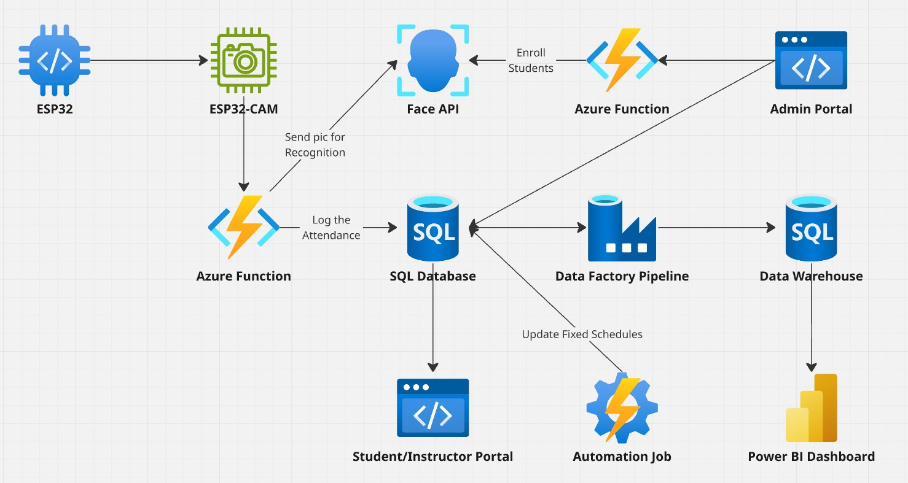
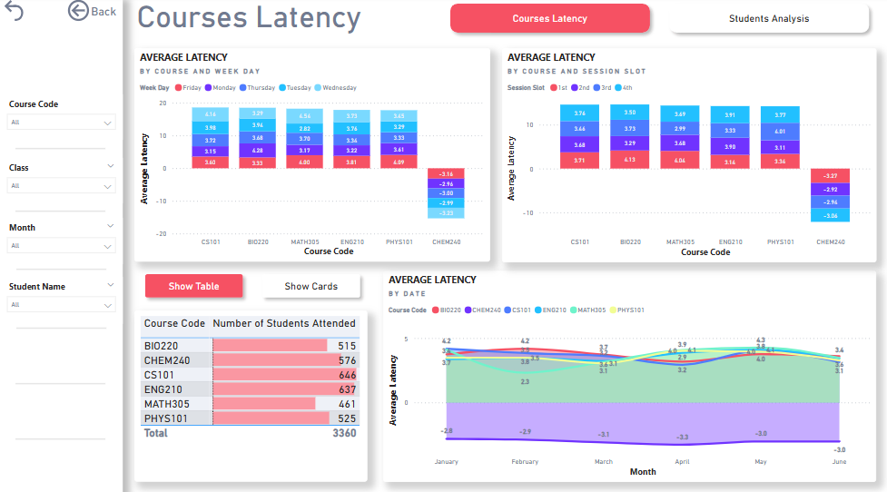
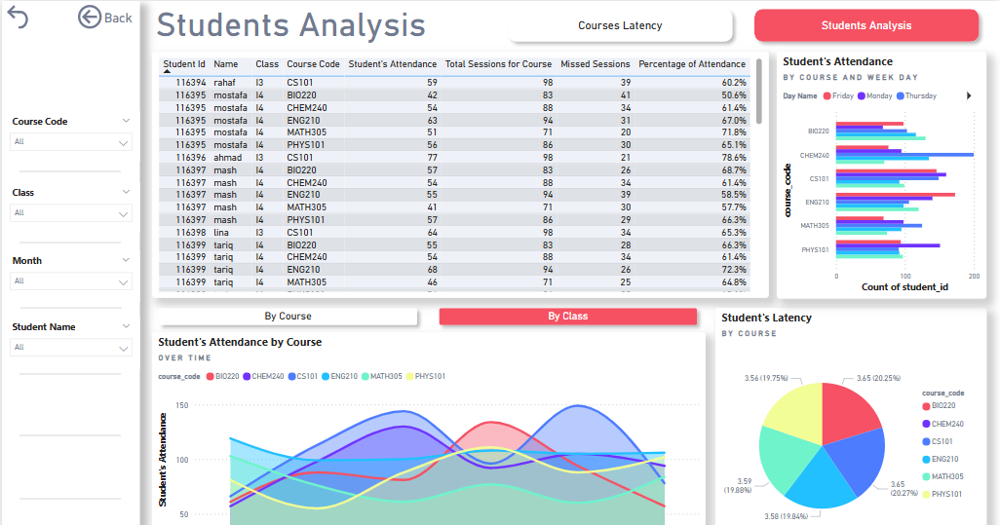

# EyeWasHere - Smart Attendance System

**EyeWasHere** is a smart attendance solution built with **ESP32-CAM**, **Azure Face API**, and **Power BI**, designed to automate attendance logging, improve accuracy, and deliver student engagement insights for educational institutions.

This monorepo includes all the system components — from IoT firmware to serverless APIs and web portals — organized as Git submodules.

---

## 🏗️ Architecture

## 🗃️ Database Schema

---

## 📸 System Overview

Students take a selfie using an ESP32-CAM device, which is processed in real-time via an Azure Function. The system verifies identity using Azure Face API, logs attendance in an Azure SQL Database, and updates dashboards through a Data Factory pipeline.

---

## 🧱 Core Technologies

### 🧰 Hardware
- ESP32-CAM (AI Thinker)
- ESP32 DevKit
- LEDs, resistors, push-button, breadboard

### ☁️ Cloud & Software
- Azure Functions (Python)
- Azure Face API (Detection, Identification, Verification)
- Azure SQL Database
- Azure Static Web Apps (React portals)
- Azure Data Factory & Data Warehouse
- Azure Automation (Schedule syncing)
- Power BI (Dashboards)

### 🛠️ Dev Tools
- GitHub + GitHub Actions (CI/CD)
- VS Code, Arduino IDE, Postman, Proteus
- DeepFace + Flask (initial prototype - optional fallback)

---

## 🌐 Web Portals

### 🧑‍💼 Admin Portal (`admin-portal`)
- Add students (with image upload)
- Add instructors and assign courses
- Add courses

### 📆 Schedules Portal (`schedules-portal`)
- 🔐 Secure login for instructors and students
- 👨‍🏫 Instructor dashboard: add/view sessions
- 🎓 Student dashboard: view personal schedules

> All portals are hosted on **Azure Static Web Apps** and connected to the database via **Data API Builder** (DAB).

---

## ⚙️ Functions

### 📥 Enroll Students Function (`enroll-students-function`)
- Handles student image uploads and face registration
- Creates/updates Face API person groups per class

### 🧠 Recognition & Attendance Function (`reco-and-attendance-function`)
- Triggered via HTTP POST from ESP32-CAM
- Validates current schedule and student identity
- Logs attendance in Azure SQL Database

---

## 🎥 ESP32-CAM Integration

The **ESP32-CAM** module allows students to mark their attendance as follows:

1. 📸 A push-button triggers the camera to capture an image.
2. 📡 The image is sent to an Azure Function that will use the Azure Face API for face recognition.
3. ✅ If verified:
   - Attendance is logged
   - Green LED turns on
4. ❌ If failed:
   - No attendance is recorded
   - Red LED turns on

Each classroom is equipped with its own standalone ESP32-CAM setup.

---

## 🔄 Automation & Dashboards

### 🔁 Automation
- **Azure Automation Job**: Weekly updates for fixed sessions without manual intervention.

### 🚀 Data Flow via Azure Data Factory
- Full Load: Dimensional tables (Courses, Users, Students, etc.) at semester-end
- Incremental Load: Fact tables (Schedules, Attendance) weekly
- All flows triggered automatically via Azure Data Factory Triggers

### 📊 Power BI Dashboards
- Analyze attendance by student, course, and day
- Drill-down capabilities: year → quarter → month → day
- Interactive filters for detailed academic monitoring

---

## 📈 Example Dashboard Insights

| 📚 Courses                              | 🎓 Students                                 |
| -------------------------------------- | ------------------------------------------- |
|  |  |

---

## 🔮 Future Work

- 🧠 Facial liveness detection to prevent spoofing
- 🔐 Biometric backup (QR codes, fingerprint)
- 🔔 Session notifications for students/instructors
- 👥 Multi-face detection per frame

---

## 🧾 Project Info

This project was developed by **Mostafa Fallaha** and **Rahaf Kobaissi** as part of the **M1 Final Project (2024–2025)**.

---