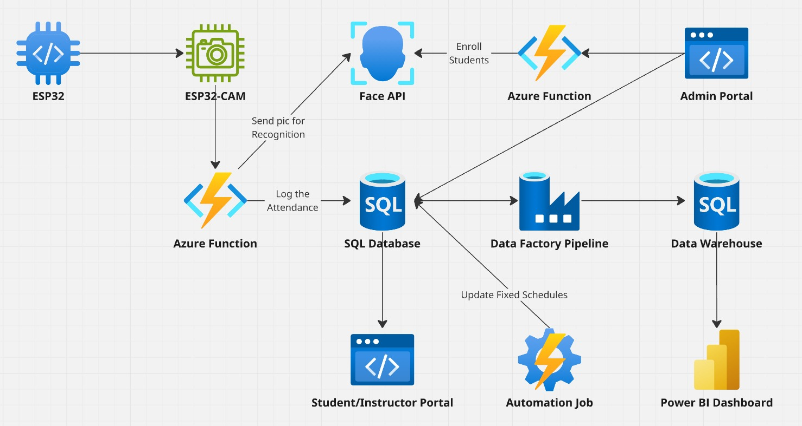
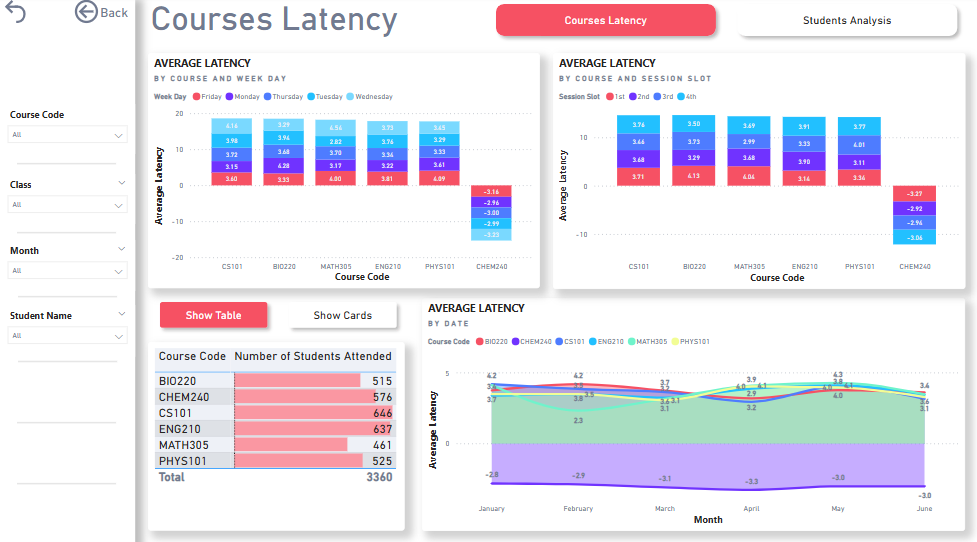
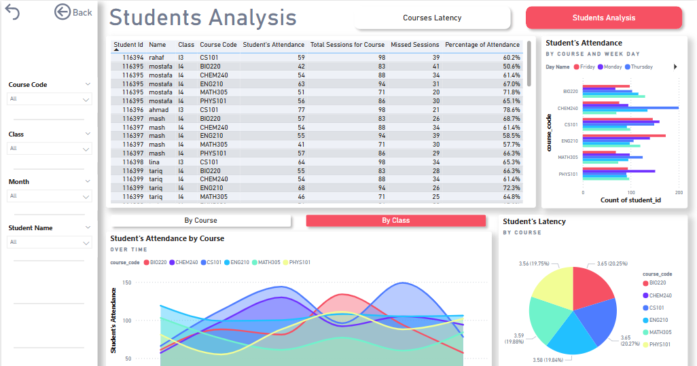

# EyeWasHere - Smart Attendance System

**EyeWasHere** is a smart attendance solution built with **ESP32-CAM**, **Azure Face API**, and **Power BI**, designed to automate attendance logging, improve accuracy, and deliver student engagement insights for educational institutions.

This monorepo includes all the system components — from IoT firmware to serverless APIs and web portals — organized as Git submodules.

---

## Architecture

## Database Schema

---

## 📸 System Overview

Students take a selfie using an ESP32-CAM device, which is processed in real-time via an Azure Function. The system verifies identity using Azure Face API, logs attendance in an Azure SQL Database, and updates dashboards through a Data Factory pipeline.

> *"Automated. Intelligent. Scalable."* — That’s our motto.

---

## 🧱 Core Technologies

* **Hardware**
  * ESP32-CAM (AI Thinker)
  * ESP32 DevKit
  * LEDs, resistors, push-button, breadboard

* **Cloud & Software**
  * Azure Functions (Python)
  * Azure Face API (Face Detection, Identification, Verification)
  * Azure SQL Database
  * Azure Static Web Apps (React portals)
  * Azure Data Factory & Data Warehouse
  * Azure Automation (Schedule syncing)
  * Power BI (Dashboards)

* **Dev Tools**
  * GitHub + GitHub Actions (CI/CD)
  * VS Code, Arduino IDE, Postman, Proteus
  * DeepFace + Flask (initial prototype - optional fallback)

---

## 🌐 Web Portals

### Admin Portal (`admin-portal`)

* Add students (with image upload)
* Add instructors and assign courses
* Add courses

### Schedules Portal (`schedules-portal`)

* 🔐 Secure login (instructors and students)
* 👨‍🏫 Instructor dashboard: add/view schedules
* 🎓 Student dashboard: view schedules

> All portals are hosted on **Azure Static Web Apps** and connected to the database via **Data API Builder** (DAB).

---

## ⚙️ Functions

### Enroll Students Function (`enroll-students-function`)

* Handles student image uploads and face registration
* Creates/updates Face API person groups

### Recognition & Attendance Function (`reco-and-attendance-function`)

* Triggered via HTTP POST from ESP32-CAM
* Validates schedule and student identity
* Logs attendance in Azure SQL Database

---

## 🔄 Automation & Dashboards

* **Azure Automation Job**: Weekly schedule updater for recurring sessions

* **Azure Data Factory**:
  * Full load for static dimension tables (courses, users)
  * Incremental load for fact tables (attendance, schedules)
  * Automatically triggered via Azure Data Factory Triggers

* **Power BI**:
  * Attendance analysis by day, student, or course
  * Drill-down capability (year > month > day) with filters

---

## 📈 Example Dashboard Insights

| Courses                              | Students                                 |
| ------------------------------------ | ---------------------------------------- |
|  |  |

---

## 📌 Future Work

* Facial liveness detection to prevent spoofing
* Biometric backup (QR codes, fingerprint)
* Session notifications
* Multi-face detection support

---

## 👥 Authors

* **Mostafa Fallaha**
* **Rahaf Kobaissi**

---

## 🗓️ Academic Year

**June 2025** – M1 Final Project (2024–2025)